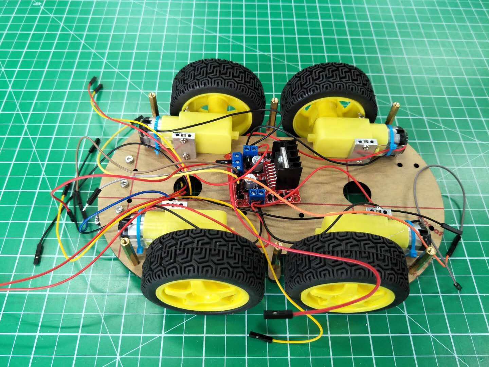
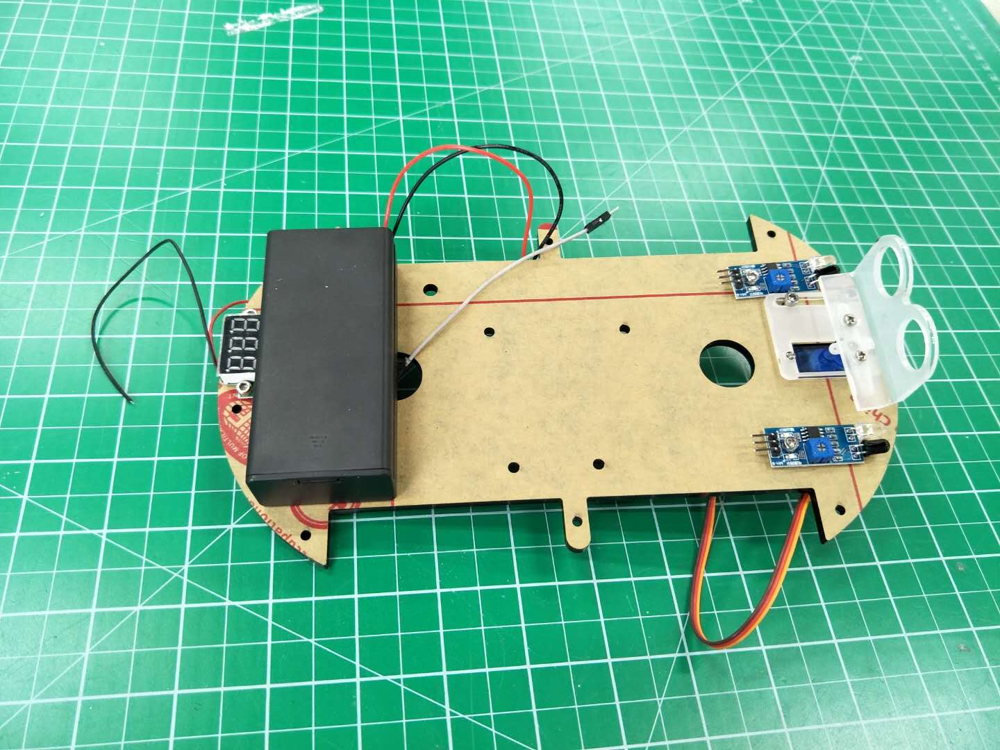
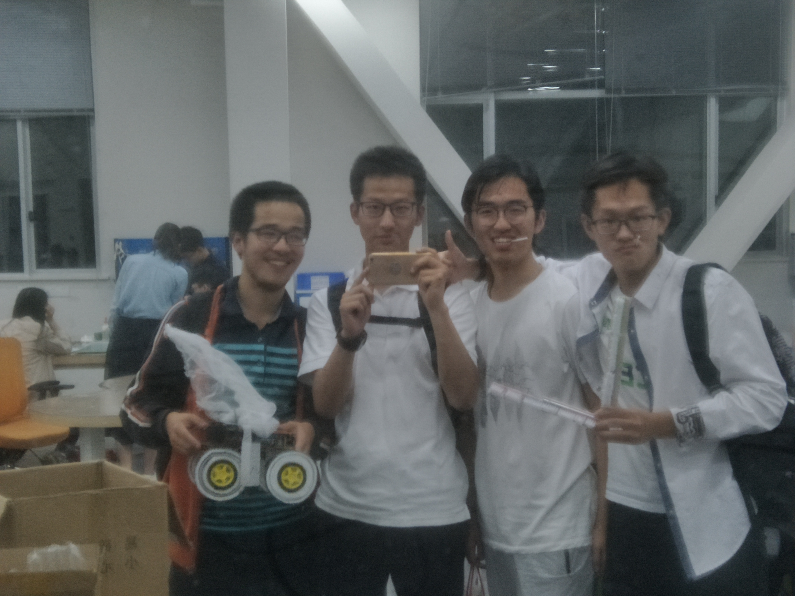

# README

## Introduction
A Danger Disposal Robot is a necessity when dangerous situation occurs.

I realize this during my work in Student Innovation Center, SJTU, as a teaching assistant. Once the water cooling system stopped running and a laser tube overheated, I have to enter the danger zone to cut the power.

The robot is 2-layer structure. The upper layer hold an arm to carry out multiple tasks. The lower layer enable robot to run.




## Acknowledgement

Thanks to the contribution of JiaLe Zhang(1), me(2), Zhe Ji(3), Jin Gao(4) from left to right in the group photo.


The project is completed in Nov, 2018. So the 3D model and real pictures of the robot are mostly lost.
But the programmes are tested can be used normally.

## Requirements
1. Two Arduino UNO boards, one for arm control, another for motion control.
2. Programmer writter to load programmes to boards.
3. BlueTooth APP to send instructions for remmote control.

## Code Structure
```
Danger Disposal Robot/
    |--Final Programmes/:
    |   |--_01.ino: Motion control of car.
    |   |--_02.ino: Arm cotrol.
    |--Component Test/:
    |   |--arm_test: Swing arms to arbitrary angles.
    |   |--drive_test: Running direction and speed control.
    |   |--hello_world: Test if the board work well.
    |   |--bluetooth_test: Print the signal received from BlueTooth APP of mobile phone.
    |   |--buzzer_test: Buzzer alarms.
    |   |--moter_test: Moter run with specified speed.
    |   |--servo_test: Servo swings to specified angle.
    |   |--ultrasonic_test: Ultrasonic model detect distance between robot and obstacles.
    |--README.md
```
